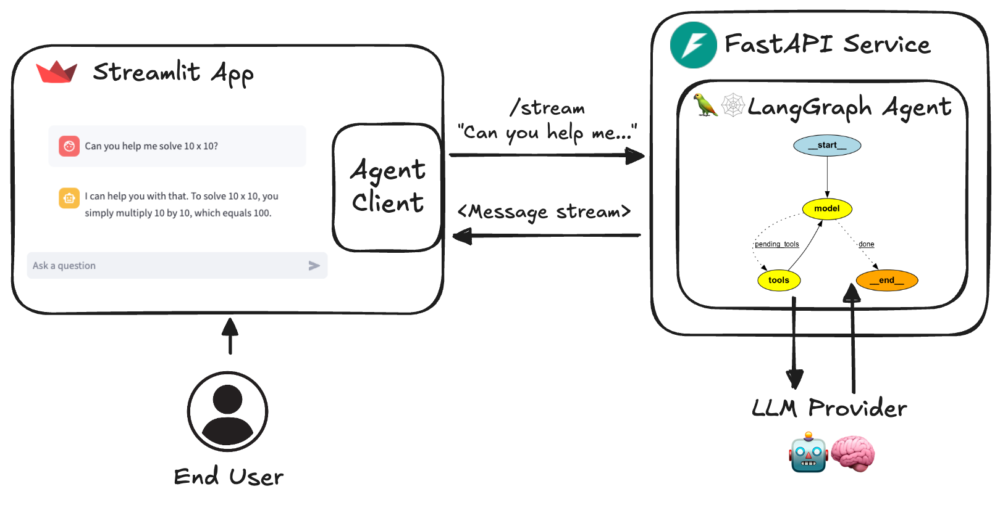

# ✨ AI Agent Studio

**AI Agent Studio** is a LangGraph-based agent platform with a FastAPI backend and Streamlit chat UI. Run multi-agent workflows locally or deploy them to free-tier hosting.

## Overview

- **LangGraph agents** — chat, research, RAG, supervisors, interrupts, MCP, and more
- **FastAPI service** — streaming and non-streaming HTTP endpoints
- **Streamlit UI** — branded chat interface with optional voice support
- **Docker Compose** — local stack with Postgres and hot reload



## Quickstart

### Python (Windows / macOS / Linux)

```sh
cp .env.example .env
# Set GOOGLE_API_KEY=... and DEFAULT_MODEL=gemini-2.0-flash
# (or OPENAI_API_KEY if you prefer OpenAI)

uv sync --frozen
# Windows: .\.venv\Scripts\Activate.ps1
# Unix: source .venv/bin/activate

python src/run_service.py
# Second terminal:
streamlit run src/streamlit_app.py
```

Open **http://localhost:8501** (UI) and **http://localhost:8080/redoc** (API).

### Docker

```sh
cp .env.example .env
# Set GOOGLE_API_KEY and DATABASE_TYPE=postgres (see .env.example)
docker compose watch
```

## Branding

Edit **`src/branding.py`** to control:

- App title, icon, and tagline
- GitHub repo URL for source links
- Per-agent welcome messages in the UI

## Environment variables

See [`.env.example`](./.env.example). Minimum for a Gemini-first setup:

| Variable | Required |
|----------|----------|
| `GOOGLE_API_KEY` (or another provider key) | Yes |
| `DEFAULT_MODEL=gemini-2.0-flash` | Recommended (set explicitly when multiple keys are present) |
| `DATABASE_TYPE=postgres` + `POSTGRES_*` | Recommended for Docker / production |
| `AUTH_SECRET` | Recommended for production |
| `AGENT_URL` | Set on Streamlit host (points to FastAPI) |

> If both `OPENAI_API_KEY` and `GOOGLE_API_KEY` are set, OpenAI is used as the default provider unless you set `DEFAULT_MODEL=gemini-2.0-flash` explicitly.

### Multiple providers and NVIDIA NIM

You can configure several LLM providers at once; all available models appear in the Streamlit Settings picker.

**NVIDIA NIM** uses the existing OpenAI-compatible settings (no extra code):

```env
GOOGLE_API_KEY=...
DEFAULT_MODEL=gemini-2.0-flash

COMPATIBLE_BASE_URL=https://integrate.api.nvidia.com/v1
COMPATIBLE_API_KEY=nvapi-...
COMPATIBLE_MODEL=meta/llama-3.1-8b-instruct
```

Select `openai-compatible` in Settings to try NIM for a session. NIM free tier is roughly **40 requests/minute** — keep Gemini as the production default.

### Pausing agents

v1 exposes `chatbot` and `research-assistant` by default. Other agents stay registered but paused (`enabled=False` in `src/agents/agents.py`). Re-enable one by flipping that flag and redeploying. Optional: set `AUTO_ENABLE_AGENTS=true` to auto-enable agents when their `required_env` keys are present.

## Project layout

| Path | Purpose |
|------|---------|
| `src/agents/` | Agent definitions |
| `src/branding.py` | App branding and welcome messages |
| `src/service/` | FastAPI app |
| `src/streamlit_app.py` | Chat UI |
| `src/client/` | HTTP client for the API |

## Add or customize agents

1. Create a module under `src/agents/`
2. Register it in `src/agents/agents.py` (set `enabled=True` to expose it)
3. Add a welcome line in `src/branding.py` → `WELCOME_MESSAGES`
4. Invoke via `POST /{agent-name}/stream` or from the Streamlit sidebar

Paused agents stay in the registry with `enabled=False` — flip the flag and redeploy to bring them back.
See [docs/RAG_Assistant.md](docs/RAG_Assistant.md) for RAG setup.

## Documentation

| Guide | Description |
|-------|-------------|
| [docs/BLUEPRINT.md](docs/BLUEPRINT.md) | Own the repo, publish, and deploy on free tier |
| [docs/RAG_Assistant.md](docs/RAG_Assistant.md) | ChromaDB RAG setup |
| [docs/GitHub_MCP_Agent.md](docs/GitHub_MCP_Agent.md) | GitHub MCP agent |
| [docs/Ollama.md](docs/Ollama.md) | Local LLM via Ollama |
| [docs/VertexAI.md](docs/VertexAI.md) | Google Vertex AI |

## Production deploy (free tier)

Stack: **Neon** (Postgres) + **Render** (FastAPI API) + **Streamlit Community Cloud** (UI). See [docs/BLUEPRINT.md](docs/BLUEPRINT.md) for the full phased plan.

### Prerequisites

1. Local smoke test passes (`python src/run_service.py` + `streamlit run src/streamlit_app.py`)
2. `pytest` passes
3. Code pushed to GitHub (`RudraPramanik/agent-harness`)

### Step 1 — Neon Postgres

1. Create a project at [neon.tech](https://neon.tech)
2. Copy connection details (prefer **pooled** host if offered)
3. Use these values on **Render only** (not Streamlit):

| Variable | Example |
|----------|---------|
| `DATABASE_TYPE` | `postgres` |
| `POSTGRES_HOST` | `ep-xxxx.region.aws.neon.tech` |
| `POSTGRES_PORT` | `5432` |
| `POSTGRES_USER` | your Neon user |
| `POSTGRES_PASSWORD` | your Neon password |
| `POSTGRES_DB` | e.g. `neondb` |

### Step 2 — Render (FastAPI API)

1. [render.com](https://render.com) → **New Web Service** → connect this repo
2. **Environment:** Docker · **Dockerfile:** `docker/Dockerfile.service` · **Port:** `8080`
3. Set environment variables:

| Variable | Required | Value |
|----------|----------|-------|
| `GOOGLE_API_KEY` | Yes | Gemini API key |
| `DEFAULT_MODEL` | Yes | `gemini-2.0-flash` |
| `DATABASE_TYPE` | Yes | `postgres` |
| `POSTGRES_HOST` | Yes | Neon host |
| `POSTGRES_PORT` | Yes | `5432` |
| `POSTGRES_USER` | Yes | Neon user |
| `POSTGRES_PASSWORD` | Yes | Neon password |
| `POSTGRES_DB` | Yes | Neon database |
| `AUTH_SECRET` | Yes | Long random string (share with Streamlit) |
| `HOST` | Yes | `0.0.0.0` |
| `PORT` | Yes | `8080` |

4. Deploy and verify:

```sh
curl https://your-service.onrender.com/health
curl https://your-service.onrender.com/info
```

> Omit `OPENAI_API_KEY` for Gemini-only v1. Do not use `DATABASE_TYPE=sqlite` on Render — data is lost on redeploy.

### Step 3 — Streamlit Community Cloud (UI)

1. [share.streamlit.io](https://share.streamlit.io) → sign in with GitHub
2. **New app** → repo `RudraPramanik/agent-harness`, branch `main`
3. **Main file path:** `src/streamlit_app.py` · **Python:** 3.12
4. **Secrets** (Settings → Secrets) — copy from [`.streamlit/secrets.toml.example`](./.streamlit/secrets.toml.example):

```toml
AGENT_URL = "https://your-service.onrender.com"
AUTH_SECRET = "same-secret-as-render"
PYTHONPATH = "src"
```

5. Deploy → open `https://<app-name>.streamlit.app` and send a test message

Dependencies install from [`requirements.txt`](./requirements.txt). Streamlit auto-rebuilds on git push.

### Environment variables by service

| Service | Variables |
|---------|-----------|
| **Render (API)** | `GOOGLE_API_KEY`, `DEFAULT_MODEL`, `DATABASE_TYPE`, `POSTGRES_*`, `AUTH_SECRET`, `HOST`, `PORT` |
| **Streamlit Cloud** | `AGENT_URL`, `AUTH_SECRET`, `PYTHONPATH` (secrets TOML) |
| **Neon** | Credentials consumed via Render `POSTGRES_*` only |
| **GitHub Actions** | `CODECOV_TOKEN` (optional), `RENDER_DEPLOY_HOOK_URL` (optional CD) |

### CI/CD

| Workflow | Trigger | Purpose |
|----------|---------|---------|
| [`test.yml`](./.github/workflows/test.yml) | Push / PR | ruff, mypy, pytest, Docker build |
| [`deploy-render.yml`](./.github/workflows/deploy-render.yml) | Push to `main` | Runs tests, then POSTs Render deploy hook if `RENDER_DEPLOY_HOOK_URL` secret is set |

Streamlit Cloud deploys independently when you push to the connected branch.

### Production smoke test

- [ ] `https://<api>.onrender.com/health` returns 200
- [ ] Streamlit app loads without connection errors
- [ ] Chat works end-to-end with Gemini
- [ ] Thread history persists after browser refresh
- [ ] API returns 401 without valid `AUTH_SECRET`

### Render cold starts (free tier)

Render sleeps after ~15 minutes idle. Before a demo, wake the API:

```text
https://your-service.onrender.com/health
```

Wait for 200, then open the Streamlit app. First request after sleep may take 30–60 seconds.

### Common issues

| Problem | Fix |
|---------|-----|
| `ModuleNotFoundError: branding` | Set `PYTHONPATH = "src"` in Streamlit secrets |
| Streamlit can't reach API | `AGENT_URL` must be the public Render URL, not `localhost` |
| 401 Unauthorized | `AUTH_SECRET` must match exactly on Render and Streamlit |
| Chat timeout on first message | Wake Render via `/health` (cold start) |

## Development

```sh
uv sync --frozen
pre-commit install
pytest
```

### Spec-driven development (OpenSpec)

This repo uses [OpenSpec](https://github.com/Fission-AI/OpenSpec) for agree-before-you-build changes. Specs live under `openspec/`; Cursor slash commands are in `.cursor/commands/`.

**One-time CLI install** (Node.js 20.19+):

```sh
npm install -g @fission-ai/openspec@latest
```

After cloning, refresh Cursor commands if needed: `openspec update`

**Workflow** (in Cursor chat — restart the IDE once after init so slash commands appear):

| Step | Command | What it does |
|------|---------|----------------|
| Explore (optional) | `/opsx:explore` | Think through an idea against the codebase |
| Propose | `/opsx:propose <change-name>` | Draft proposal, delta specs, design, tasks |
| Apply | `/opsx:apply` | Implement the task checklist |
| Archive | `/opsx:archive` | Merge specs into `openspec/specs/` and archive the change |

Useful CLI: `openspec list`, `openspec show <change>`, `openspec validate <change>`, `openspec view`.

You do **not** need to document the whole codebase first — write specs only for what you are changing. Project context for AI is in [`openspec/config.yaml`](./openspec/config.yaml).

## License

MIT — see [LICENSE](./LICENSE).
