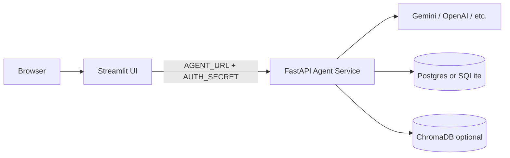

# Blueprint: Own, Update, Publish & Deploy AI Agent Studio

A phased plan to take this repo from a local fork to a live, branded deployment on free-tier infrastructure.

---

## Table of contents

1. [Architecture overview](#architecture-overview)
2. [Phase 1 — Make the repo yours](#phase-1--make-the-repo-yours)
3. [Phase 2 — Local validation](#phase-2--local-validation)
4. [Phase 3 — Publish on GitHub](#phase-3--publish-on-github)
5. [Phase 4 — Free-tier deployment](#phase-4--free-tier-deployment)
6. [Phase 5 — Alternative hosting paths](#phase-5--alternative-hosting-paths)
7. [Phase 6 — Customize agents (product roadmap)](#phase-6--customize-agents-product-roadmap)
8. [Phase 7 — Ongoing operations](#phase-7--ongoing-operations)
9. [Suggested timeline](#suggested-timeline)
10. [Files reference](#files-reference)
11. [Common pitfalls](#common-pitfalls)
12. [Definition of done](#definition-of-done)

---

## Architecture overview

This project splits into two deployable services plus optional data stores:



| Component | Path | Role |
|-----------|------|------|
| **FastAPI service** | `src/run_service.py` | Runs LangGraph agents, streaming, memory, auth |
| **Streamlit UI** | `src/streamlit_app.py` | Branded chat interface, agent picker, voice (optional) |
| **Agent definitions** | `src/agents/` | Individual agent graphs and tools |
| **Branding** | `src/branding.py` | App title, welcome messages, GitHub links |
| **HTTP client** | `src/client/` | Streamlit → API communication |
| **Memory** | `src/memory/` | SQLite, Postgres, or MongoDB checkpointers |

### Recommended free-tier stack

| Layer | Service | Notes |
|-------|---------|-------|
| UI | [Streamlit Community Cloud](https://share.streamlit.io) | Free for public GitHub repos |
| API | [Render](https://render.com) Web Service | Free tier sleeps after inactivity; cold starts |
| Database | [Neon](https://neon.tech) Postgres | Free tier (~0.5 GB); persistent conversation memory |
| LLM | [Google Gemini API](https://aistudio.google.com/apikey) | Free quota; set `GOOGLE_API_KEY` |
| DNS | Render / Streamlit subdomains | Free (`*.onrender.com`, `*.streamlit.app`) |

---

## Phase 1 — Make the repo yours

**Goal:** Rebrand, configure secrets, and decide which agents to ship.

### 1.1 Create your GitHub repository

1. Create a new repository on GitHub (e.g. `YOUR_USERNAME/ai-agent-studio`).
2. Point your local project at it:

```bash
git remote remove origin   # if an old upstream remote exists
git remote add origin https://github.com/YOUR_USERNAME/ai-agent-studio.git
git branch -M main
git push -u origin main
```

Keep upstream attribution in `README.md` and `LICENSE` (MIT requires it). This project is based on [agent-service-toolkit](https://github.com/JoshuaC215/agent-service-toolkit).

### 1.2 Branding checklist

| File | What to change |
|------|----------------|
| `src/branding.py` | `APP_TITLE`, `APP_ICON`, `APP_TAGLINE`, `GITHUB_OWNER`, `GITHUB_REPO`, `AUTHOR_NAME`, `AUTHOR_LINK`, `WELCOME_MESSAGES` |
| `README.md` | Your repo URL, author name, live deploy URLs, screenshots |
| `pyproject.toml` | `name`, `description`, `authors` (optional rename) |
| `.github/workflows/deploy.yml` | Line 15: replace `YOUR_USERNAME/ai-agent-studio` with your `owner/repo` |
| `LICENSE` | Your copyright line (upstream credit already included) |

`src/branding.py` is the single most important UI customization file. Streamlit reads it for the app title, sidebar, per-agent welcome text, and GitHub source links.

### 1.3 Product decisions

| Decision | Where to configure |
|----------|-------------------|
| Default agent | `src/agents/agents.py` → `DEFAULT_AGENT` (currently `research-assistant`) |
| Pause demo agents | Set `enabled=False` on agents in `src/agents/agents.py` (do not delete modules) |
| Default LLM | `.env` → `GOOGLE_API_KEY` + `DEFAULT_MODEL=gemini-2.0-flash` (set explicitly if multiple provider keys exist) |
| RAG assistant | Uses OpenAI embeddings today — see [Phase 6](#phase-6--customize-agents-product-roadmap) |
| NVIDIA NIM (optional) | `COMPATIBLE_BASE_URL=https://integrate.api.nvidia.com/v1` + `COMPATIBLE_API_KEY` + `COMPATIBLE_MODEL` (~40 RPM free tier; keep Gemini as production default) |

**Suggested v1 public demo agents (enabled):**

- `chatbot` — general conversation
- `research-assistant` — web search, calculator, weather

Other agents (supervisors, command, bg-task, rag, kb, github-mcp, interrupt-agent) remain registered but **paused**. Re-enable by setting `enabled=True` on that agent entry.

### 1.4 Environment variables (Gemini-first)

Create `.env` from `.env.example`:

```env
# LLM — Gemini Developer API
GOOGLE_API_KEY=your-gemini-api-key
DEFAULT_MODEL=gemini-2.0-flash

# Do NOT set OPENAI_API_KEY unless you need RAG or voice features
# OPENAI_API_KEY=

# Auth (required for production)
AUTH_SECRET=generate-a-long-random-string

# Database — local dev
DATABASE_TYPE=sqlite
SQLITE_DB_PATH=checkpoints.db

# Server
HOST=0.0.0.0
PORT=8080
```

> **Important:** The variable must be `GOOGLE_API_KEY`, not `Gemini_API_KEY`. If both `OPENAI_API_KEY` and `GOOGLE_API_KEY` are set, OpenAI is checked first and becomes the default provider.

Get a Gemini key: [Google AI Studio](https://aistudio.google.com/apikey)

### 1.5 Secrets hygiene

- Never commit `.env` (already in `.gitignore`).
- Rotate any API key that was exposed in chat, logs, or accidental commits.
- Use host "Secrets" / "Environment variables" panels in production — not files in the repo.

---

## Phase 2 — Local validation

**Goal:** Confirm everything works before deploying.

### 2.1 Install and run (Python)

```bash
cp .env.example .env
# Edit .env with your GOOGLE_API_KEY

uv sync --frozen

# Terminal 1 — API
python src/run_service.py

# Terminal 2 — UI
streamlit run src/streamlit_app.py
```

- API: http://localhost:8080/redoc
- UI: http://localhost:8501

### 2.2 Smoke test checklist

- [ ] UI loads with your branding from `src/branding.py`
- [ ] Agent list appears in the sidebar
- [ ] Chat works with Gemini (pick an agent, send a message)
- [ ] `GET http://localhost:8080/info` returns service metadata
- [ ] `GET http://localhost:8080/health` returns healthy

### 2.3 Run with Docker Compose (optional, matches production)

Set in `.env`:

```env
DATABASE_TYPE=postgres
POSTGRES_USER=postgres
POSTGRES_PASSWORD=postgres
POSTGRES_HOST=postgres
POSTGRES_PORT=5432
POSTGRES_DB=agent_service
GOOGLE_API_KEY=your-key
DEFAULT_MODEL=gemini-2.0-flash
AUTH_SECRET=your-secret
```

Then:

```bash
docker compose watch
```

This starts Postgres, the FastAPI service (port 8080), and Streamlit (port 8501) with hot reload.

### 2.4 Run tests

```bash
uv sync --frozen
pytest
```

CI runs the same suite on push via `.github/workflows/test.yml`.

---

## Phase 3 — Publish on GitHub

**Goal:** Push your branded code and enable CI.

### 3.1 Pre-push checklist

- [ ] No secrets in git (`git status`, search for `API_KEY`, `SECRET`, `PASSWORD`)
- [ ] `src/branding.py` has your real `GITHUB_OWNER` and `GITHUB_REPO`
- [ ] `README.md` reflects your project name and author
- [ ] Tests pass locally (`pytest`)

### 3.2 Push

```bash
git add .
git commit -m "Personalize branding and configure Gemini as default LLM"
git push origin main
```

### 3.3 GitHub Actions

| Workflow | Purpose | Action needed |
|----------|---------|---------------|
| `.github/workflows/test.yml` | Lint, mypy, pytest, Docker build | Runs automatically on push/PR |
| `.github/workflows/deploy.yml` | Azure + Docker Hub deploy | Update repo name on line 15; add secrets only if using Azure |

Optional secret for Codecov coverage: `CODECOV_TOKEN`

The deploy workflow is gated to `YOUR_USERNAME/ai-agent-studio` — update that condition before enabling automated deploys.

---

## Phase 4 — Free-tier deployment

**Goal:** Live public URL for both API and UI at $0/month.

### 4.1 Deploy Postgres (Neon)

1. Sign up at [neon.tech](https://neon.tech).
2. Create a project and database.
3. Copy the connection details into separate env vars:

```env
POSTGRES_HOST=ep-xxxx.region.aws.neon.tech
POSTGRES_PORT=5432
POSTGRES_USER=your-user
POSTGRES_PASSWORD=your-password
POSTGRES_DB=neondb
DATABASE_TYPE=postgres
```

Use the **pooled** connection string if Neon offers one (better for serverless/free tiers).

### 4.2 Deploy FastAPI (Render)

1. Sign up at [render.com](https://render.com) and connect your GitHub repo.
2. **New → Web Service**:
   - **Root directory:** repo root
   - **Environment:** Docker
   - **Dockerfile path:** `docker/Dockerfile.service`
   - **Port:** `8080`
3. Set environment variables in the Render dashboard:

```env
GOOGLE_API_KEY=your-key
DEFAULT_MODEL=gemini-2.0-flash
DATABASE_TYPE=postgres
POSTGRES_HOST=...
POSTGRES_PORT=5432
POSTGRES_USER=...
POSTGRES_PASSWORD=...
POSTGRES_DB=...
AUTH_SECRET=long-random-secret-shared-with-streamlit
HOST=0.0.0.0
PORT=8080
```

4. Deploy and note your URL: `https://your-agent-service.onrender.com`

**Verify:**

```bash
curl https://your-agent-service.onrender.com/info
curl https://your-agent-service.onrender.com/health
```

**Render free tier caveats:**

- Service **sleeps** after ~15 minutes of inactivity.
- First request after sleep has a **cold start** (~30–60 seconds).
- Fine for demos and portfolio projects; not suitable for production SLA.

### 4.3 Deploy Streamlit (Streamlit Community Cloud)

1. Sign up at [share.streamlit.io](https://share.streamlit.io).
2. **New app** → select your GitHub repo.
3. **Main file path:** `src/streamlit_app.py`
4. **Python version:** 3.12
5. Set **Secrets** (Settings → Secrets):

```toml
AGENT_URL = "https://your-agent-service.onrender.com"
AUTH_SECRET = "same-secret-as-render"
```

6. Deploy and note your URL: `https://your-app-name.streamlit.app`

#### Streamlit Cloud import path

The app imports `branding`, `client`, and `schema` from the `src/` directory. If imports fail on Streamlit Cloud, add to secrets or environment:

```toml
PYTHONPATH = "src"
```

Or create a `.streamlit/config.toml` in the repo:

```toml
[server]
headless = true

[runner]
fastReruns = true
```

If needed, add a root-level `requirements.txt` or ensure Streamlit detects dependencies from `pyproject.toml` (Streamlit Cloud reads `requirements.txt` if present).

### 4.4 Production verification checklist

- [ ] `https://your-api.onrender.com/info` returns JSON
- [ ] Streamlit app loads without "cannot reach agent service" errors
- [ ] Chat works end-to-end with Gemini
- [ ] Starting a new thread and refreshing preserves history (Postgres working)
- [ ] Unauthorized requests are rejected when `AUTH_SECRET` is set

### 4.5 Wake the API before demos

Because Render free tier sleeps, open the API health endpoint in a browser tab a minute before a live demo:

```
https://your-agent-service.onrender.com/health
```

Wait for a 200 response, then open the Streamlit app.

---

## Phase 5 — Alternative hosting paths

| Goal | Option | Notes |
|------|--------|-------|
| Simplest API hosting | **Fly.io** | Credit-based free allowance; deploy `Dockerfile.service` |
| All-in-one Docker | **Fly.io** with compose | More ops; single machine runs API + Postgres |
| No external DB (demo only) | `DATABASE_TYPE=sqlite` on Render | **Data lost on redeploy** — not for production |
| Custom domain | **Cloudflare DNS** (free) | Point CNAME to Render or Streamlit |
| CI → auto deploy | GitHub Actions → Render deploy hook | Replace Azure workflow in `deploy.yml` |
| Azure (paid) | Existing `deploy.yml` | Docker Hub + Azure Web App; not free long-term |

### Gemini-only vs OpenAI dependencies

| Feature | Works with Gemini only? |
|---------|-------------------------|
| `chatbot`, `research-assistant`, supervisors, interrupt, command, bg-task | Yes |
| `rag-assistant` | **No** — Chroma embeddings use OpenAI (`OpenAIEmbeddings` in `src/agents/tools.py`) |
| Voice STT/TTS | **No** — OpenAI only (`src/voice/`) |
| `knowledge-base-agent` | **No** — requires AWS Bedrock Knowledge Base |
| `github-mcp-agent` | Yes (needs `GITHUB_PAT`, not OpenAI) |
| Safeguard (research/rag) | Optional Groq (`GROQ_API_KEY`); skipped if not set |

---

## Phase 6 — Customize agents (product roadmap)

After deployment works, iterate in this order:

| Priority | Task | Files |
|----------|------|-------|
| 1 | Set default agent and trim demo agents | `src/agents/agents.py` |
| 2 | Customize research assistant prompt and tools | `src/agents/research_assistant.py`, `src/agents/tools.py` |
| 3 | Add your RAG documents | `scripts/create_chroma_db.py`, `src/agents/tools.py`, `src/agents/rag_assistant.py` |
| 4 | Switch RAG embeddings to Google | `src/agents/tools.py` (replace `OpenAIEmbeddings`) |
| 5 | Add a custom agent | New module under `src/agents/` → register in `agents.py` → welcome in `branding.py` |
| 6 | Production hardening | `AUTH_SECRET`, rate limits, error handling, disable unused agents |

See also:

- [RAG_Assistant.md](./RAG_Assistant.md) — ChromaDB setup
- [GitHub_MCP_Agent.md](./GitHub_MCP_Agent.md) — GitHub MCP tools
- [Ollama.md](./Ollama.md) — local LLM (experimental)
- [VertexAI.md](./VertexAI.md) — Google Vertex AI (GCP)

### Adding a new agent (quick reference)

1. Create `src/agents/my_agent.py` with a compiled LangGraph graph.
2. Register in `src/agents/agents.py`:

```python
"my-agent": Agent(description="What it does.", graph_like=my_agent),
```

3. Add a welcome message in `src/branding.py` → `WELCOME_MESSAGES`.
4. Invoke via `POST /my-agent/stream` or select it in the Streamlit sidebar.

---

## Phase 7 — Ongoing operations

| Task | Frequency |
|------|-----------|
| Monitor Gemini API usage | Weekly |
| Rotate `AUTH_SECRET` and API keys | On leak or quarterly |
| Pull upstream fixes from agent-service-toolkit | Optional, monthly |
| Backup Neon Postgres | Before major changes |
| Wake Render API before demos | Each demo session |
| Review GitHub Actions CI results | On every push |

### Monitoring and tracing (optional)

| Service | Env vars | Purpose |
|---------|----------|---------|
| LangSmith | `LANGSMITH_TRACING`, `LANGSMITH_API_KEY`, `LANGSMITH_PROJECT` | Trace agent runs |
| Langfuse | `LANGFUSE_TRACING`, `LANGFUSE_PUBLIC_KEY`, `LANGFUSE_SECRET_KEY` | Observability |

Disable tracing in production if you do not need conversation logging (see `PRIVACY_NOTICE` in `src/branding.py`).

---

## Suggested timeline

| When | Goal |
|------|------|
| **Day 1–2** | Branding (`branding.py`, README), Gemini `.env`, trim agents, push to GitHub |
| **Day 3–4** | Neon Postgres + Render API + Streamlit Cloud, end-to-end smoke test |
| **Week 2** | README with live URLs, custom welcome messages, one custom agent |
| **Week 2+** | RAG with your docs, custom domain, CI deploy to Render |

---

## Files reference

```
src/
├── branding.py              ← Your identity (title, welcome messages, GitHub links)
├── streamlit_app.py         ← Chat UI
├── run_service.py           ← FastAPI entry point
├── agents/
│   ├── agents.py            ← Agent registry, DEFAULT_AGENT
│   ├── research_assistant.py
│   ├── rag_assistant.py
│   └── ...
├── service/service.py       ← FastAPI routes, streaming, auth
├── client/client.py         ← HTTP client for API
├── core/settings.py         ← Env var loading, model provider detection
└── memory/                  ← SQLite / Postgres / Mongo checkpointers

docker/
├── Dockerfile.service       ← Production API image
└── Dockerfile.app           ← Production Streamlit image

compose.yaml                 ← Local full stack (Postgres + API + UI)
.env.example                 ← Template for all env vars
.github/workflows/
├── test.yml                 ← CI: lint, test, Docker build
└── deploy.yml               ← Optional Azure deploy
docs/
├── BLUEPRINT.md             ← This file
├── RAG_Assistant.md
├── GitHub_MCP_Agent.md
└── ...
```

---

## Common pitfalls

| Problem | Solution |
|---------|----------|
| Used `Gemini_API_KEY` instead of `GOOGLE_API_KEY` | Rename to `GOOGLE_API_KEY` |
| Both OpenAI and Google keys set | OpenAI wins as default; remove `OPENAI_API_KEY` for Gemini-only |
| Streamlit can't reach API | Set `AGENT_URL` to public Render URL, not `localhost` |
| 401 Unauthorized from API | `AUTH_SECRET` must match on API and Streamlit |
| Render cold start / timeout | Wake API with `/health` before opening Streamlit |
| Conversation history lost | Don't use SQLite on Render; use Neon Postgres |
| RAG fails with Gemini-only setup | RAG needs OpenAI embeddings or code change to Google embeddings |
| Deploy workflow never runs | Update `if: github.repository == 'YOUR_USERNAME/ai-agent-studio'` in `deploy.yml` |
| API key exposed | Rotate immediately in Google AI Studio |

---

## Definition of done

You are fully published when:

- [ ] Code lives in **your** GitHub repository with your branding
- [ ] Live Streamlit URL works for anyone with the link
- [ ] API deployed on Render (or equivalent) with Postgres on Neon
- [ ] Gemini chat works end-to-end in production
- [ ] `AUTH_SECRET` protects the API
- [ ] README documents how to run locally and links to your live app
- [ ] No secrets committed to git

---

## Quick command reference

```bash
# Local dev
uv sync --frozen
python src/run_service.py
streamlit run src/streamlit_app.py

# Docker full stack
docker compose watch

# Tests
pytest

# Create RAG database (optional)
python scripts/create_chroma_db.py
```

---

*Built on [agent-service-toolkit](https://github.com/JoshuaC215/agent-service-toolkit) (MIT). Customize freely — keep upstream attribution in LICENSE and README.*
