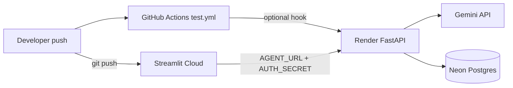

## Context

AI Agent Studio runs as two services: FastAPI (`src/run_service.py`) and Streamlit (`src/streamlit_app.py`). CI exists in `.github/workflows/test.yml`. `deploy.yml` targets Azure + Docker Hub — not the free-tier path. `docs/BLUEPRINT.md` Phase 4 describes Render + Neon + Streamlit but is not actionable as a single deploy runbook.

Repo: `RudraPramanik/agent-harness`. Branding spec is archived. No live deployment yet.

## Goals / Non-Goals

**Goals:**

- Live public demo at $0/month.
- Clear env var matrix: what goes on Render, Streamlit secrets, Neon, GitHub.
- CI stays green; optional CD hook for Render API.
- Streamlit Community Cloud deploy documented step-by-step.

**Non-Goals:**

- Azure CD (leave `deploy.yml` as-is or deprecate later).
- Streamlit deploy via GitHub Actions (Streamlit handles UI deploy).
- Custom domain, Fly.io, Railway alternatives (documented in BLUEPRINT only).

## Architecture



## Decisions

### 1. Render for API (Docker)

**Decision:** Deploy API with `docker/Dockerfile.service`, port 8080, Docker environment on Render.

**Rationale:** Matches local Docker path; `uv.lock` reproducible in image.

### 2. Streamlit Community Cloud for UI (not Docker)

**Decision:** Deploy `src/streamlit_app.py` directly on Streamlit Cloud; do not use `Dockerfile.app` for free tier.

**Rationale:** Streamlit Cloud free tier expects a Python app entrypoint, not a custom Docker image. Simpler and free.

### 3. Neon for Postgres

**Decision:** External Neon DB; `DATABASE_TYPE=postgres` on Render only.

**Rationale:** Render ephemeral disk; SQLite loses data on redeploy.

### 4. Shared `AUTH_SECRET`

**Decision:** Same random string on Render and in Streamlit secrets.

**Rationale:** Already implemented — `HTTPBearer` on API, `Authorization` header in `src/client/client.py`.

### 5. CI unchanged; CD additive

**Decision:** Keep `test.yml`; add optional `deploy-render.yml` or extend workflow with Render deploy hook.

**Rationale:** Tests must pass before deploy; Streamlit redeploys independently on git push.

## Environment variable reference (complete)

### Render (FastAPI API) — required for v1

```env
GOOGLE_API_KEY=...
DEFAULT_MODEL=gemini-2.0-flash
DATABASE_TYPE=postgres
POSTGRES_HOST=ep-xxxx.region.aws.neon.tech
POSTGRES_PORT=5432
POSTGRES_USER=...
POSTGRES_PASSWORD=...
POSTGRES_DB=neondb
AUTH_SECRET=<long-random-string>
HOST=0.0.0.0
PORT=8080
```

### Streamlit Community Cloud — Secrets (TOML)

```toml
AGENT_URL = "https://your-service.onrender.com"
AUTH_SECRET = "<same-as-render>"
PYTHONPATH = "src"
```

### Neon — no app env on Streamlit

Create project at [neon.tech](https://neon.tech); copy connection fields into Render env vars above.

### GitHub Actions — optional secrets

| Secret | Service |
|--------|---------|
| `CODECOV_TOKEN` | Codecov upload |
| `RENDER_DEPLOY_HOOK_URL` | POST after CI on main (optional CD) |

### Not needed on hosted services (v1)

- `OPENAI_API_KEY` — omit for Gemini-only
- `GITHUB_PAT` — only if shipping github-mcp-agent
- Voice vars — client-side, OpenAI-only; skip for v1
- LangSmith/Langfuse — optional observability

## Streamlit free-tier deploy (step-by-step)

1. **Prerequisites:** API live on Render; `/health` returns 200.
2. Sign up at [share.streamlit.io](https://share.streamlit.io) with GitHub.
3. **New app** → repo `RudraPramanik/agent-harness`, branch `main`.
4. **Main file path:** `src/streamlit_app.py`
5. **Python version:** 3.12
6. **Advanced settings → Secrets** — paste TOML with `AGENT_URL`, `AUTH_SECRET`, `PYTHONPATH`.
7. **Deploy** — wait for build (installs from `pyproject.toml` or `requirements.txt` if present).
8. **Verify:** open `https://<app-name>.streamlit.app`, send a chat message.
9. **Wake API first** if cold: open `https://<api>.onrender.com/health` before demo.

### Streamlit dependency install

Streamlit Cloud reads `requirements.txt` if present, else may parse `pyproject.toml`. If build fails, add a root `requirements.txt` generated from `uv export` or minimal client deps.

### Common Streamlit Cloud failures

| Problem | Fix |
|---------|-----|
| `ModuleNotFoundError: branding` | `PYTHONPATH = "src"` in secrets |
| Cannot reach agent | `AGENT_URL` must be public Render URL, not `localhost` |
| 401 from API | `AUTH_SECRET` must match Render exactly |
| Timeout on first message | Wake Render API via `/health` (cold start) |

## CI/CD workflow

```
push/PR → test.yml (ruff, mypy, pytest, docker build)
main + CI pass → optional POST RENDER_DEPLOY_HOOK_URL
git push → Streamlit Cloud auto-rebuilds UI
```

## Risks / Trade-offs

| Risk | Mitigation |
|------|------------|
| Render cold start | Document wake-before-demo |
| Streamlit build can't resolve deps | Add `requirements.txt` |
| Secret mismatch | Copy-paste checklist in tasks |
| Gemini quota | Monitor in Google AI Studio |

## Open Questions

- Add root `requirements.txt` for Streamlit Cloud now or wait for first failed build?
- Replace Azure `deploy.yml` with Render workflow or add separate `deploy-render.yml`?
- Enable Render auto-deploy on git push vs deploy hook only after CI?
