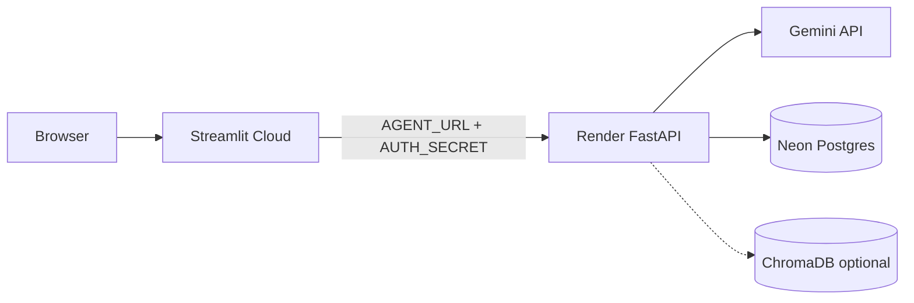

## Context

AI Agent Studio is a Python monorepo forked from [agent-service-toolkit](https://github.com/JoshuaC215/agent-service-toolkit). It already implements LangGraph agents, FastAPI streaming, Streamlit UI, Docker Compose, and CI. `docs/BLUEPRINT.md` describes a 7-phase plan from local fork to live free-tier deployment.

Current state (partial):

- Branding scaffold exists (`src/branding.py`) but `GITHUB_OWNER` is still `YOUR_USERNAME`.
- Full agent registry is present (10+ agents); v1 should trim to 2–3.
- Gemini-first `.env` pattern documented; RAG/voice still need OpenAI.
- No live deployment yet; OpenSpec specs are empty.

## Goals / Non-Goals

**Goals:**

- Publish a **branded, live demo** anyone can use via Streamlit URL.
- Run the API on **Render** with **Neon Postgres** for durable memory.
- Use **Gemini** as the sole LLM for v1 public agents.
- Keep **$0/month** on recommended stack (Render free + Streamlit Cloud + Neon free + Gemini free quota).
- Establish OpenSpec as the behavioral source of truth for platform, deployment, and agents.

**Non-Goals:**

- Always-on SLA or sub-second cold starts on Render free tier.
- Gemini-only RAG (requires embedding provider change in `src/agents/tools.py`).
- Voice features in production without OpenAI.
- Azure/paid hosting (optional path in `deploy.yml`, not v1).
- Back-filling specs for every internal agent implementation detail.

## Decisions

### 1. Two-service split (keep existing architecture)

**Decision:** Deploy FastAPI and Streamlit as separate services, not a single container.

**Rationale:** Matches existing code (`run_service.py` + `streamlit_app.py`), aligns with free tiers (Render for API, Streamlit Cloud for UI), and allows independent scaling/redeploy.

**Alternatives considered:** Single Fly.io machine with compose — more ops, worse fit for Streamlit Cloud's zero-config UI hosting.

### 2. Gemini-first, OpenAI opt-in

**Decision:** V1 production omits `OPENAI_API_KEY`; document that dual-key setups make OpenAI the default.

**Rationale:** Free Gemini quota, simpler secrets, matches BLUEPRINT Phase 1.4. RAG and voice remain opt-in later.

### 3. Postgres on Neon for production memory

**Decision:** `DATABASE_TYPE=postgres` with Neon; SQLite only for local dev.

**Rationale:** Render ephemeral filesystem loses SQLite on redeploy. Neon free tier (~0.5 GB) is sufficient for demo/portfolio conversation memory.

### 4. Shared-secret auth between UI and API

**Decision:** Use `AUTH_SECRET` on both Render and Streamlit Cloud (no OAuth for v1).

**Rationale:** Already implemented in the service layer; sufficient for a public demo that blocks casual API abuse.

### 5. Curated v1 agent catalog

**Decision:** Ship `chatbot`, `research-assistant`, optional `interrupt-agent`; hide supervisors, command, bg-task, kb-agent from public picker.

**Rationale:** Reduces confusion, avoids agents that need extra providers (Bedrock, OpenAI embeddings), and showcases core LangGraph value.

### 6. Branding single source of truth

**Decision:** All identity changes go through `src/branding.py` first, then README/pyproject.

**Rationale:** Streamlit reads branding at runtime; avoids drift between UI and docs.

## Architecture (how it fits together)

| Phase | What | Key files / actions |
|-------|------|---------------------|
| 1 — Own the repo | Brand, env, trim agents | `branding.py`, `agents.py`, `.env`, README |
| 2 — Local validation | Smoke test, Docker, pytest | `run_service.py`, `compose.yaml`, `pytest` |
| 3 — Publish | Push to GitHub, CI green | `.github/workflows/test.yml` |
| 4 — Deploy | Neon + Render + Streamlit | `Dockerfile.service`, host secrets |
| 5 — Alternatives | Fly.io, custom domain | Optional; not v1 |
| 6 — Customize agents | RAG, custom agent, prompts | `src/agents/`, `scripts/create_chroma_db.py` |
| 7 — Operations | Key rotation, wake API, backups | Runbook in BLUEPRINT |

## Risks / Trade-offs

| Risk | Mitigation |
|------|------------|
| Render cold start kills demo UX | Wake `/health` 1 min before demo; document in README |
| Gemini quota exhaustion | Monitor usage weekly; set billing alerts in Google AI Studio |
| `AUTH_SECRET` mismatch → 401 | Use identical secret on Render and Streamlit; verify in smoke test |
| Streamlit import failures on Cloud | Set `PYTHONPATH=src` in secrets if needed |
| RAG users expect Gemini-only | Document OpenAI requirement; Phase 6 embedding migration |
| Secrets committed | Pre-push grep for `API_KEY`; rotate if leaked |

## Migration Plan

This change is **spec-only** — no code migration. Implementation follows phased tasks:

1. Complete Phase 1–2 locally (branding, env, agent trim, tests).
2. Push to GitHub (Phase 3).
3. Provision Neon → Render → Streamlit Cloud (Phase 4).
4. Run production verification checklist.
5. Archive this OpenSpec change to merge specs into `openspec/specs/`.
6. Future changes (custom agent, RAG, domain) get their own OpenSpec proposals.

**Rollback:** Revert branding/agent changes via git; destroy Render/Streamlit apps if needed. Neon data retained until manually deleted.

## Open Questions

- Final GitHub `owner/repo` for `GITHUB_OWNER` / `GITHUB_REPO` in branding?
- Will v1 include `interrupt-agent` in the public picker or keep it dev-only?
- Custom domain (Cloudflare) in week 2 or later?
- Enable Langfuse/LangSmith tracing in production or keep disabled for privacy?
